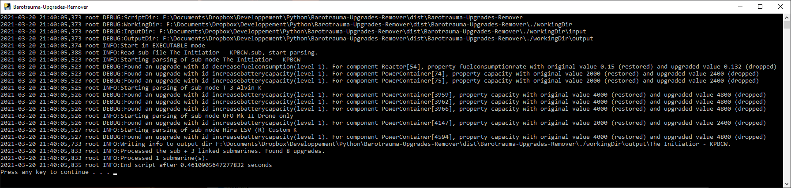

# Barotrauma submarine upgrades remover.

## Description

The idea is to provide a way to easily removes all the upgrades from a submarine (and its linked submarine, aka shuttle) automatically.

The usecase is for example if you are uncompressing your campaign file and edit your submarine mid-campaign and you want to use these modifications in future campaigns.
Since the submarine properties are edited in the submarine file when you upgrade something, using this .sub file without reverting the upgrades in a new campaign is OP because you will start with all the stats already upgraded. (and you can even upgrade them again !)

So this tool restores all the items to their original values while retaining the modifications that you made to the sub.

## Installation

With python3 installed. (Carefull the installer creation doesn't work on windows with a python version installed from the micrososft store)

1. Install pip:

`curl https://bootstrap.pypa.io/get-pip.py -o get-pip.py`

`python3 get-pip.py`

2. Install virtualenv

`pip install virtualenv`

3. Create virtualenv

`virtualenv env`

4. Load env

With visual studio code, use the "Select interpreter command".

If on windows: check execution policy with `Get-ExecutionPolicy`
[Windows online help](https:/go.microsoft.com/fwlink/?LinkID=135170)

Change policy to remote signed to authorize script to execute.

`Set-ExecutionPolicy -ExecutionPolicy RemoteSigned`

5. Install requirements

`pip install -r .\requirements.txt`

## Running

Drop your .sub file retrieved from your campaign in the **workingdir/input** folder where you downloaded the python script. You can get using using the [Save-Decompressor](https://github.com/Jlobblet/Barotrauma-Save-Decompressor)

The tool will automatically loop over all the sub files in there and produces 3 files in the **workingdir/output/<subfilename>** folder.
- *subfilename.xml* : the original xml describing the sub as zipped in the original .sub file.
- *subfilename_noUpgrades.xml* : the submarines with all its upgrades removed and its original valeus restored.
- *subfilename.sub* : Upgrades removed version of the submarines but in a .sub format. (gzipped)

To start the script in **dev env**, no option is required, just run `python3 main.py`

With **executable**, just run the executable

## Testing

Once the .sub has been produced, you can load it inside the editor to check that the values have indeed been restored to their original.

## Generating executable

Within the dev env, run

`python -m PyInstaller --name "Barotrauma-Upgrades-Remover" --add-data "workingdir/input/drop_your_sub_file_here.txt;workingdir/input/drop_your_sub_file_here.txt" "src\main.py" --noconfirm`

## Examples

